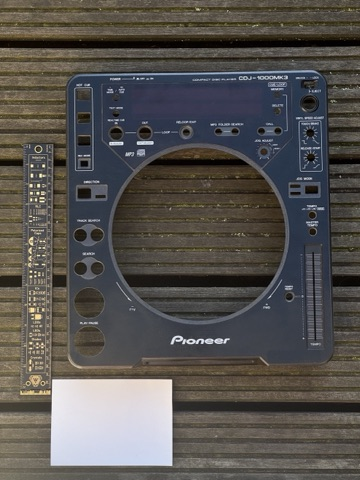
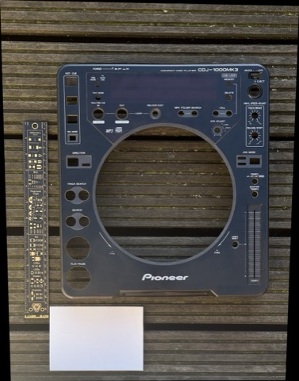
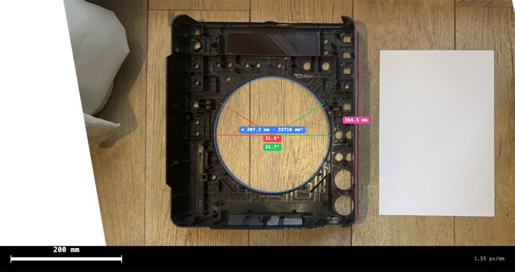

# Skwik

Client-side image deskewing tool. Upload a photo taken at an angle, place reference measurements on known objects, and get a perspective-corrected output with real-world scale.

Everything runs in the browser -- no server, no uploads.

## Example

<table>
  <tr>
    <td width="50%" align="center">
      <br/>
      <em>Before — angled shot</em>
    </td>
    <td width="50%" align="center">
      <br/>
      <em>After — corrected perspective</em>
    </td>
  </tr>
  <tr>
    <td colspan="2" align="center">
      <br/>
      <em>Measured — annotations baked in</em>
    </td>
  </tr>
</table>

## How it works

1. **Upload** a JPG or HEIC image (HEIC is converted automatically). Past uploads are cached and reopen straight into Measure with their datums and annotations restored.
2. **Review EXIF** data -- camera, lens, focal length.
3. **Place datums** on the image -- rectangles, lines, or ellipses (circles) with known real-world dimensions. Each datum carries a 1--5 confidence score. One datum can be flagged as the world-axis reference to fix the output orientation.
4. **Deskew** -- OpenCV.js computes a perspective transform and produces a corrected image at a configurable px/mm scale, with per-datum residuals and a global RMS error reported.
5. **Measure** -- annotate the corrected image with lines, rectangles, ellipses, circles, and angles in real-world units. Export the bare PNG, or the image with measurements baked in (full resolution or current viewport).

### The algorithm

The pipeline picks a **primary** datum that fixes the output gauge (orientation, position, scale): any datum the user explicitly flagged as the world-axis reference, otherwise the highest-confidence rectangle, then ellipse, then line. The primary's known dimensions are mapped onto an axis-aligned output frame via `cv.getPerspectiveTransform` -- that's the warm-start homography.

That homography is then refined by an alternating-minimization loop around `cv.findHomography` (which internally runs DLT + Levenberg-Marquardt). On every outer pass, each datum is turned into output-space point correspondences using its shape constraint:

- **Rectangle** -- Procrustes-fit an ideal `w × h` rectangle to the current projection of the user-marked corners.
- **Line** -- preserve the projected midpoint and direction, rescale to the expected length.
- **Ellipse** -- sample 12 points along the user ellipse, project them, then radially snap to a circle of the expected diameter centred on the projected user-marked centre. Forces circles to stay circular under perspective.

Confidence scores (1--5) are realised as integer replication of correspondences -- `cv.findHomography` has no native weighting. The primary additionally gets a ×3 gauge boost so its anchors don't drift while secondary datums are being satisfied. The loop runs until the homography stops moving (max-entry relative delta below 1e-6) or 30 iterations, with period-2 oscillation detection logging a warning if the alternating minimization fails to converge.

A single `cv.warpPerspective` with Lanczos resampling produces the corrected image at the requested px/mm scale; output bounds are derived by projecting the source image corners through the final homography and clamped to a 12288 px maximum dimension to keep WASM heap usage bounded.

Per-datum residuals are reported alongside the result: edge length error and corner perpendicularity for rectangles, length error for lines, and isotropy / skew / equivalent-diameter error from the projected conic for ellipses, plus a global RMS percentage across all of them.

## Quick start

```bash
pnpm install
pnpm dev
```

Open `http://localhost:5173`.

## Build

```bash
pnpm build      # type-check + production build
pnpm preview    # serve the build locally
```

## Lint & format

```bash
pnpm lint       # eslint (strict TS + Vue)
pnpm lint:fix   # auto-fix
pnpm format     # prettier
pnpm type-check # vue-tsc
```

## Stack

| Layer | Tech |
|---|---|
| Framework | Vue 3 + TypeScript (strict) |
| Build | Vite |
| Components | shadcn-vue + Tailwind CSS v4 |
| Canvas | Konva.js + vue-konva |
| CV | OpenCV.js 4.12 (WASM) |
| HEIC | heic-to |
| EXIF | exifr |
| State | Pinia |

## Datum presets

Rectangles: A3, A4, A5, A6, 15×10 cm. Circles: €1, €2, US 25¢, UK 1p, CD. Custom dimensions supported on every type; lines accept any length.

## How Skwik compares

There are plenty of tools that do *part* of what Skwik does, but none that combine everything:

| Tool | Client-side | Multi-datum weighting | Real-world mm scale | Measurement tools | Scale bar export |
|---|:---:|:---:|:---:|:---:|:---:|
| [**Skwik**](https://serv.e1n.sh/git/sam1902/skwik) | ✅ | ✅ | ✅ | ✅ | ✅ |
| [MYOG Perspective Correction](https://www.myogtutorials.com/free-online-image-perspective-correction-tool/) | ✅ | ❌ | ✅ | ❌ | ❌ |
| [PerspectiveFix](https://oathanrex.github.io/perspective-fix/) | ✅ | ❌ | ❌ | ❌ | ❌ |
| [PicFix.pro](https://picfix.pro/) | ✅ | ❌ | ❌ | ❌ | ❌ |
| [ImageOnline Perspective](https://imageonline.io/perspective-tool/) | ✅ | ❌ | ❌ | ❌ | ❌ |
| [Toolschimp Image Measure](https://www.toolschimp.com/image-measure) | ✅ | ❌ | ✅ | ✅ | ❌ |
| [Aspose Deskew](https://products.aspose.app/imaging/image-deskew) | ❌ | ❌ | ❌ | ❌ | ❌ |

Most deskew tools just pull 4 corners to a rectangle without any real-world dimensions -- the output has no scale. Most measurement tools calibrate against a single reference and don't correct perspective. Skwik uses multiple weighted datums (rectangles, lines, and ellipses, each with a confidence score) to solve both problems in one pass, and lets you measure distances or export with a scale bar on the corrected image.

## License

GNU General Public License v3.0
